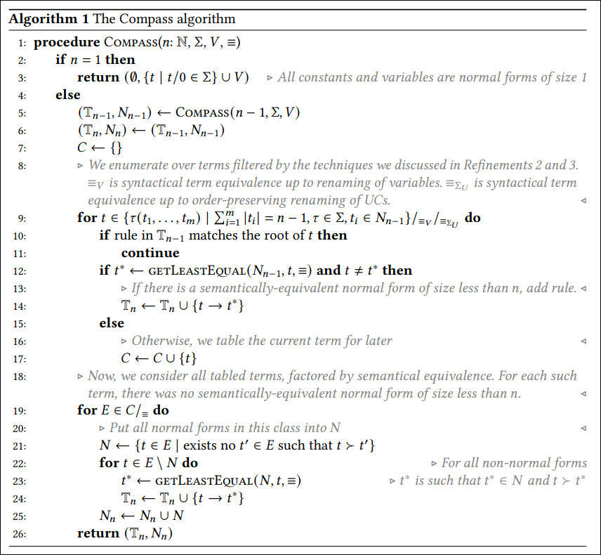

# Compass: Synthesis of Term Rewriting Systems with Bounded Completeness

POPL 2027: TODO



Sample call
``` 
dune exec bin/main.exe -- --domain bool --max-size 30 --max-vcs 3 --max-vars 0 --max-holes 3 --rule-output bool.rules
``` 

With all outputs:
```
--output bool_min_3_330_out.txt 
--rule-output bool_min_3_330_rules.txt 
--irred-output bool_min_3_330_irred.txt 
--stats bool_min_3_330_stats.csv
```

Other checks: 
```
--random-inputs [N]
--smt
```
`--smt` needs `z3` on the `PATH`.

To simplify terms:
```
dune build
./_build/default/bin/main.exe --domain bool --eval --rules-input bool.rules --terms-input terms.txt
```

To swap lower/upper-case of uninterpreted constants (UCs) and variables, use `--lower-vars`. Per default, UCs are lowercase and variables uppercase, as in the paper.

## Structure

| module | role (paper) |
|---|---|
| `Term` | terms over variables, uninterpreted constants (`Uc`) and symbols |
| `Kbo` | size-KBO |
| `Index`, `Rewrite` | discrimination tree, matching with order-preserving constant renaming (Refinement 3) |
| `Enumerate` | terms whose arguments are injective renamings of normal forms (Refinements 2, 3) |
| `Theory`; `domain/`: `Boolean`, `Integer`, `Bitvector`, `Demo`, `Bool_min` | signatures with semantics and SMT-LIB encodings |
| `Semantics`, `Smt`, `Oracle` | fingerprints and equivalence: exhaustive, z3, or random testing |
| `Synth` | Algorithm 1 |
| `Syntax` | printing and parsing |

A new theory is a module satisfying `Theory.THEORY`.


