# Evaluation

We evaluate the size-stratified rule synthesizer (`rule_enum`) along four
questions:

- **Convergence:** Does enumerating terms by size produce a *finite,
  complete* rule set, and how far does it scale per domain?
- **Variables vs. holes:** How does enumerating with object *variables*
  compare to enumerating with *holes* (constant placeholders) only — in cost,
  in the number of normal forms, and in generality?
- **Coverage vs. Ruler:** How do our rules compare to those produced by
  Ruler (OOPSLA'21) in terms of mutual derivability?
- **Simplification:** How well do the synthesized rules simplify random
  terms, and how does that depend on rule-set completeness?

---

## Synthesis converges to a finite, complete rule set

Go to zero. First no new irreducible (only finite many equivalence classes), then no terms enumerated (follows from irreducible).
In that case, we are totally complete.

For variables, we have more irreducible (and hence enumerated) but less rules.
For bool outcome is no difference as we are complete.
But generally with variables is better (also top down not just bottom up).

<!-- The central observation: although the number of *enumerated* terms grows
exponentially (millions per size), the number of new KBO-rules and new
irreducibles falls to **zero** at a finite size and stays there. At that point
the rule set is **complete up to the enumeration bound**: every larger term is
already reducible by an existing rule, so no new normal form can appear. -->

For `bool` with 3 variables + 3 holes (`bool_vcs3`):

| size | enumerated | +KR | +IR | total KR | total IR |
|-----:|-----------:|----:|----:|---------:|---------:|
| 12 | 2.35 M | 94 | 32 | 2217 | 1186 |
| 13 | 4.41 M | 25 | 9 | 2242 | 1195 |
| **14** | 5.88 M | **1** | **1** | **2243** | **1196** |
| 15–20 | up to 9.1 M | **0** | **0** | 2243 | 1196 |

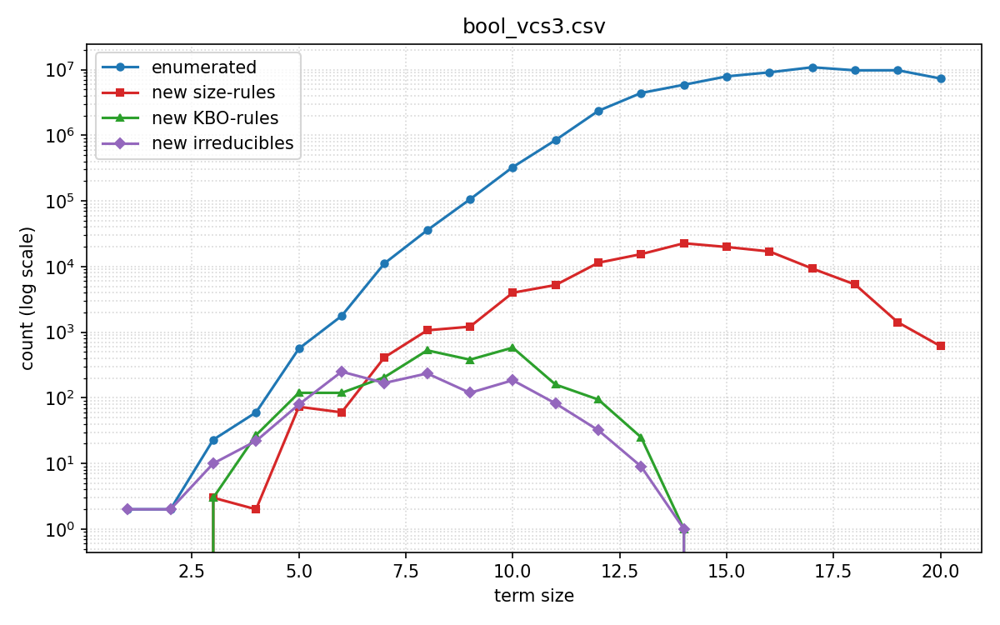

*Figure RQ1. `bool_vcs3`: new KBO-rules (green) and new irreducibles (purple)
vanish at size 14, while enumerated terms (blue) keep growing. The **2243 KBO
rules + 1196 irreducibles** capture every boolean equality up to size 20.*

<!-- **Observation — SR keeps growing after completion.** Size-reducing rules (red)
keep being added past size 14 even though no new class appears. These are *new
left-hand sides* of size > 14 that reduce to one of the existing 1196 normal
forms: they are derivable from the completed set and add no expressive power
(they are the redundancy a post-hoc minimization pass would remove). The
*theory* is complete at size 14; the long SR tail is just the set growing its
index of reducible patterns. -->

**SMT domains scale to useful sizes** (they do not saturate):

| domain | reached size | total IR | total KR | wall-clock |
|--------|-------------:|---------:|---------:|-----------:|
| `int_vcs3` | 11 | 160 565 | 64 002 | 365 s |
| `bv4_vcs3` (width 4) | 8 | 674 913 | 69 897 | 1169 s |

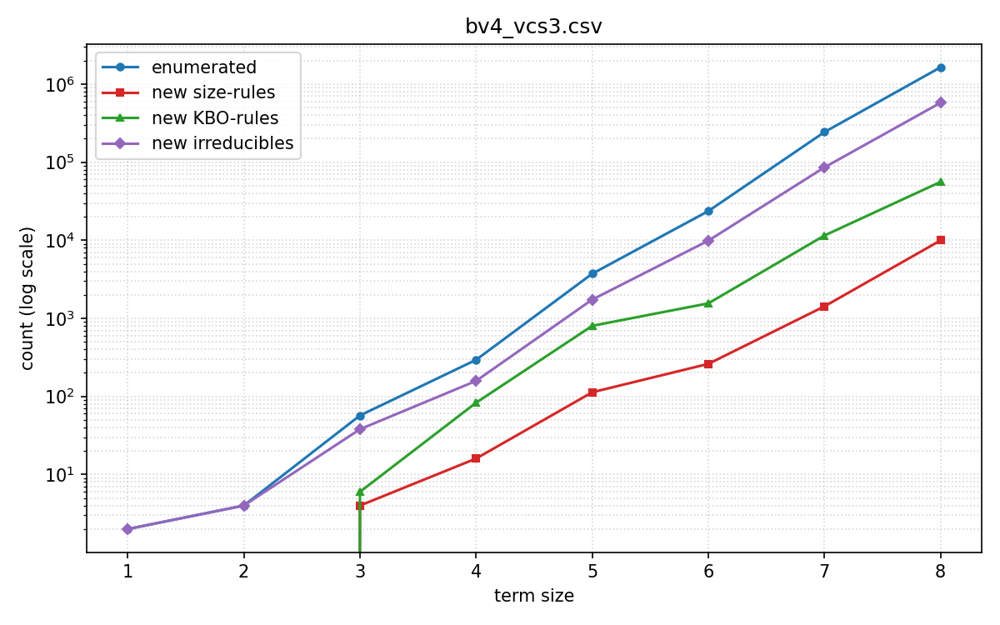

*Figure RQ1b. `bv4_vcs3` keeps producing new irreducibles — the integer and
bitvector theories are far richer than boolean, so we report "scales to size N
within T" rather than completion.*

---

## Variables vs. holes: generality vs. number of classes

We run `bool` two ways: with object variables and holes (`bool_vcs3`,
`--max-vars 3 --max-holes 3`) and with **holes only** (`bool_v0c3`,
`--max-vars 0 --max-holes 3`).

| run | classes (IR) | KBO rules | completes at | time |
|-----|-------------:|----------:|-------------:|-----:|
| `bool_v0c3` (holes only) | **232** | 1187 | size 10 | 2535 s |
| `bool_vcs3` (vars + holes) | **1196** | 2243 | size 14 | 9985 s |

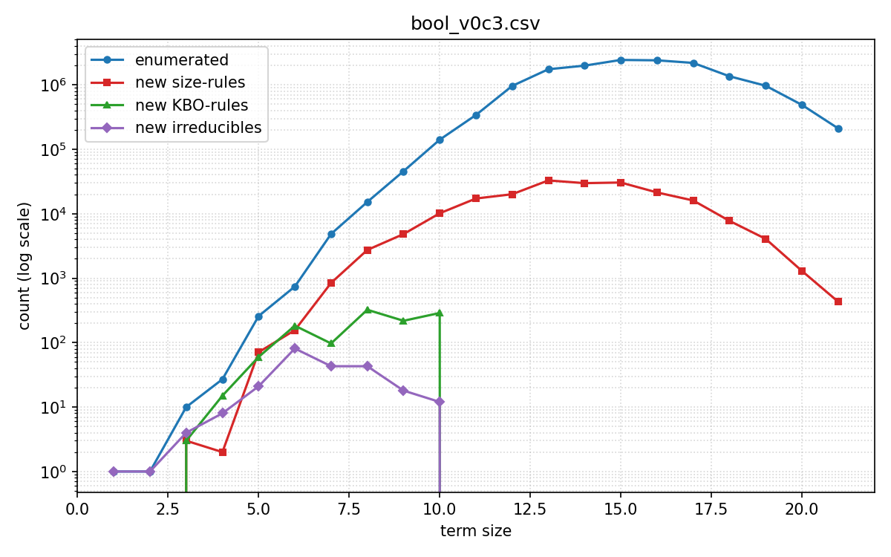

*Figure RQ2. `bool_v0c3` (holes only) converges earlier (size 10) to a much
smaller set — 232 irreducibles vs. 1196.*

**Why holes-only has fewer classes.** A *hole* is an opaque constant
placeholder: a holes-only term denotes a single boolean function, and each
semantic equivalence class has **at most one irreducible** (its KBO-minimal
representative). Renaming of holes collapses classes further (e.g. a term in
`X,Y` and its `Y,X` swap are the same class), so the count is *smaller* still.
This is the most economical possible normal-form set — exactly one
representative per behaviour, up to renaming.

**Why adding variables produces more.** An object *variable* ranges over all
instantiations, so a term with variables denotes a *family* of functions and
must agree with its rewrite target on *every* instantiation. This splits the
space into two kinds of classes — **placeholder/constant classes** *and*
**variable classes** — and the latter are genuinely new (a variable identity
need not hold for arbitrary constants and vice versa). Hence `bool_vcs3` has
~5× more irreducibles (1196 vs. 232) and takes ~4× longer.

**Why they are equivalent for `bool`.** Because we *complete* the
enumeration in both settings, both rule sets decide the *same* boolean
equational theory. The variable-bearing rules are strictly **more general** —
a single rule with variables matches all instances, where the holes-only system
would need one rule per pattern — but the set of equalities they prove is
identical. So for a finite domain like `bool`, holes-only is the *faster* presentation of the *same* theory. This is
confirmed externally in Section 3: our holes-only rules derive all of Ruler's
variable rules and vice versa.

---

## Coverage vs. Ruler (mutual derivability)

Ruler synthesizes boolean rulesets via equality saturation; the number of
iterations bounds the size of the rules it can produce. **Ruler `it2` produces
rules with terms up to size 5; `it4` up to size 9.** To compare like with like
we restrict *our* synthesis to the matching size cap (`--max-size 5/7/9`,
written `s5`/`s7`/`s9`) and check mutual derivability with Ruler's own `derive`
checker. `forward` = how many of **our** rules Ruler can re-derive; `reverse` =
how many of **Ruler's** rules **our** set derives.

| comparison (matched size) | Ruler ⊢ ours | ours ⊢ Ruler |
|---------------------------|:------------:|:------------:|
| `it2` ↔ `s5`  (size ≤ 5) | 154 / 0 | 18 / 0 |
| `it4` ↔ `s7`  (size ≤ 7) | 1431 / **2** | 32 / **1** |
| `it4` ↔ `s9`  (size ≤ 9) | 8890 / **645** | **33 / 0** |

- **Size ≤ 5 — perfectly mutual.** Every rule of each system is derivable from
  the other; the two approaches agree exactly on the small-rule theory.
- **Size ≤ 7 — near-mutual.** Ruler derives all but 2 of our rules; we derive
  all but 1 of Ruler's. The residual handful are orientation artifacts.
- **Size ≤ 9 — we are strictly stronger.** Our rules derive **100 % (33/33)** of
  Ruler's, while Ruler **fails to derive 645** of ours. At this size our
  exhaustive enumeration finds equalities Ruler's bounded saturation misses.

As a sanity check we also normalized Ruler's own rule terms with our rules
(`eval/ruler/ruler_bool_3_2_0_norm_vcs3.txt`): every Ruler equality collapses to
a single normal form, i.e. **our rules prove all of Ruler's equalities**.

### Synthesis cost

How long does it take to *produce* these rule sets? Our times are the cumulative
synthesis wall-clock (from the run logs, 4 workers); Ruler's are re-measured on
the same machine (`./target/debug/bool synth --variables 3 --iters {2,4}`).
Recall `it2 ≈ size 5`, `it4 ≈ size 9`.

| rule set | rules | synth time |
|----------|------:|-----------:|
| ours, holes-only, size ≤ 5 (`bool_v0c3_s5`) | 154 | < 0.05 s |
| ours, holes-only, size ≤ 9 (`bool_v0c3_s9`) | 9 535 | 0.5 s |
| ours, vars+holes, size ≤ 5 (`bool_vcs3_s5`) | 227 | < 0.05 s |
| ours, vars+holes, size ≤ 9 (`bool_vcs3_s9`) | 4 213 | 1.1 s |
| ours, vars+holes, **full / complete** (`bool_vcs3`) | 117 265 | 9 985 s (≈ 2.8 h) |
| Ruler `it2` (≈ size 5) | 18 | 0.29 s |
| Ruler `it4` (≈ size 9) | 33 | 128 s |

**(1) Reaching a given rule size is cheap for us.** Our size-9
variable set (4 213 rules) is synthesized in **1.1 s**, ~100× faster than Ruler's
**128 s** for its size-9 set — exhaustive size-stratified enumeration up to size 9
is far cheaper than 4 iterations of equality saturation. 
---

## Simplification of random terms

We generate two random-term benchmarks with `scripts/termgen.py` (3 vars, fixed
seed 42): **1000 terms of size 50** (`bool_50_3`) and **1000 terms of size 500**
(`bool_500_3`) — `-n` sets the term size, `--sample 1000` the number of terms.
We greedily normalize them with various rule sets and plot the cumulative
distribution of normal-form sizes (a curve that reaches 1.0 on the left means
"almost everything reduced to something small").

### Completeness drives reduction

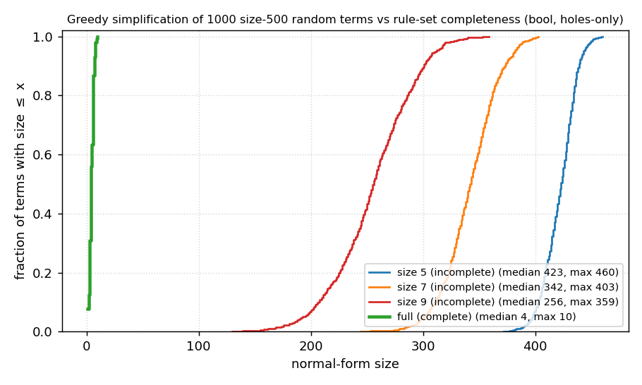

*Figure RQ4a. 1000 size-500 random terms (holes-only rules). Capped rule sets are
**incomplete**, so the greedy normalizer gets stuck: medians 423 (s5), 342 (s7),
256 (s9). The **complete** set reduces every term to size ≤ 10.*

The key structural fact: **the largest irreducible in the complete holes-only
set has size 10** (`bool_v0c3` has 232 irreducibles, the biggest of size 10).
Since a greedy normal form is by definition an irreducible, **no term can
normalize to anything larger than 10** — and indeed all 1000 size-500 random
terms reduce to size ≤ 10 (median 4). The capped sets `s5/s7/s9` only know rules
up to that size, so once a term is rewritten below the cap they have nothing
left to apply and it remains large; raising the cap monotonically shifts the
whole distribution left, converging to the complete-set wall at 10.

### Variables make incomplete rule sets far stronger

The same sweep with the *variable* rule sets (`bool_vcs3_s5/s9/full`) tells a
sharper story:

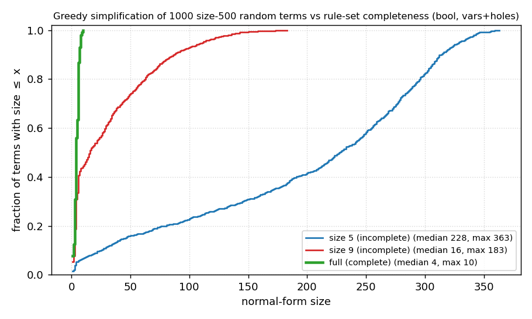

*Figure RQ4b. 1000 size-500 random terms, **variable** rules. At the same size
caps the medians are 228 (s5) and **16** (s9) — versus 423 and 256 for the
holes-only sets in Fig. RQ4a. The complete (full) curve is **identical** to the
holes-only full curve (median 4, max 10).*

This is the practical payoff of generality (cf. Section 2). A variable rule like
`A&A -> A` matches *any* subterm, so the size-capped variable sets fire all over
a random term; the holes-only capped sets only match exact constant patterns and
rarely fire. Hence at size 9 the variable rules already reduce the median to 16
while the holes-only rules are stuck at 256. Once *complete*, the two agree
exactly — the full variable and full holes-only sets produce the **same** normal
forms on all 1000 terms (confirming the Section 2 claim that they decide the same
theory), but the variable system gets there with far fewer, more general rules
and is far more effective when truncated.

### Ruler vs. ours, greedy

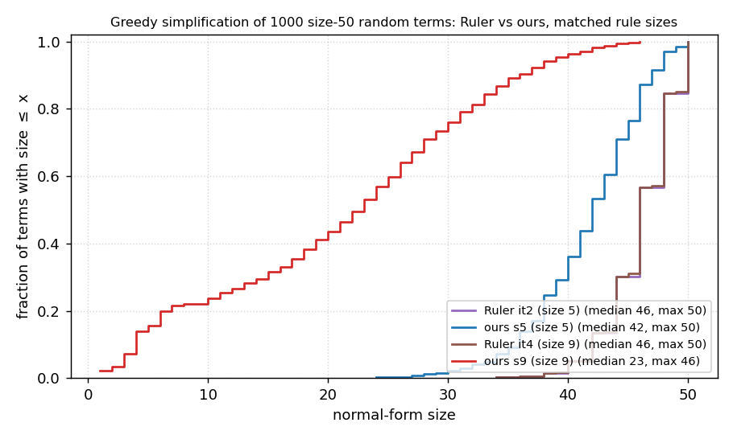

*Figure RQ4c. 1000 size-50 random terms, greedy, holes-only rules. Ruler `it2`
(median 46) and `it4` (median 46) are nearly indistinguishable; ours `s5`
(median 42) is similar, ours `s9` (median 23) is clearly best.*

**Why Ruler `it2` ≈ `it4` here?** Under *greedy* rewriting Ruler's
rules barely fire on size-50 random terms: `it2` and `it4` outputs differ on only
**22 of 1000** terms, and both leave the median at 46 (only ~4 of 50 nodes
removed). `it4` *does* add 15 rules over `it2` (several size-reducing), but they
match so rarely on random subterms that the distributions are visually identical.
This is expected, not a bug: Ruler emits a small set of *bidirectional* equalities
for *equality saturation*, not an oriented rewrite system — greedy application
understates them. Our (holes-only,
oriented) rules are built for terminating greedy normalization and Ruler's are
not.

### Ruler vs. ours, equality saturation (e-graph)

Running the *same* rule sets in an e-graph (`scripts/egglog/simplify.py`,
**shared / parallel** mode — all 1000 terms in one e-graph, 2 saturation
iterations) is the fair setting for Ruler's bidirectional rules:

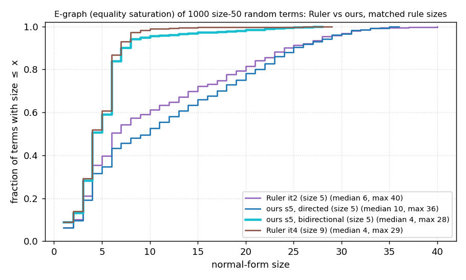

*Figure RQ4d. 1000 size-50 random terms, equality saturation (shared e-graph,
parallel mode). Medians: Ruler `it2` 6, `it4` 4, ours `s5` directed 10, ours
`s5` **bidirectional 4**.*

Two observations. (1) **Equality saturation is far more powerful than greedy for
these compact rule sets** — Ruler's `it4` median drops from 46 (greedy) to 4
(e-graph). (2) As emitted, Ruler's rules *edge out* ours at matched size (Ruler
`it2` median 6 vs. ours `s5` median 10) — the mirror image of the greedy result.

**The gap is orientation, not coverage.** Ruler emits
**bidirectional** rules (**10 of its 18** are two-way, including
associativity/commutativity `(&?a ?b) <-> (&?b ?a)`), whereas our exported rules
are **0 of 154** bidirectional — every one a single directed, size/KBO-decreasing
rewrite. In an e-graph, two-way AC rules explore *all* reorderings of a subterm
within the fixed 2-iteration budget; our directed rules only push toward the
KBO-minimal side, so saturation reaches fewer equivalent forms.

To test this we re-ran our `s5` set with every rule marked **bidirectional
wherever the reverse is a valid grounded rewrite** (123 of 154 reverse cleanly;
the other 31 have a bare-variable rhs like `?a&?a -> ?a` that cannot be a
left-hand side). The result (cyan curve) **flips the ranking**: our bidirectional
`s5` reaches **median 4 / mean 5.1 / max 28**, beating Ruler `it2` (median 6,
mean 10.7) at the same size and matching Ruler `it4`. So our underperformance in
the e-graph was purely the directed orientation we ship for greedy rewriting —
once the rules are made two-way, our larger, more-complete set is the strongest.
(The holes-vs-vars distinction is irrelevant here: the converter maps both holes
and object variables to e-graph pattern variables `?a`.) Directed, terminating
rules are exactly what a single greedy / discrimination-tree pass wants — which
is why the picture flips again in Fig. RQ4c.

**Why ours `s9` is not in the e-graph plot.** Our exported rule sets are *large
and redundant*: `bool_v0c3_s9` expands to **9535** rewrite rules (vs. 33 for
Ruler `it4`), because we emit every size-reducing pattern, not a compact
generating set. Loaded wholesale into a *shared* e-graph over 1000 terms this
blows up (the run did not saturate). 

*(We also has a per-term `sequential` mode; `eqsat_*_sequential` is slower
and weaker than the shared-e-graph `parallel` mode and is kept only for
reference.)*

### Engines compared: greedy vs. e-graph (parallel / sequential)

We benchmarked the three normalizers on 50 random terms of growing size (memory-
safe node caps: parallel 100 k, sequential 50 k). E-graph cost is
`O(#terms × 6^iters)` in nodes (AC rules grow the graph ~6×/iteration) and
extraction scales with graph size; greedy memory is `O(term size)`.

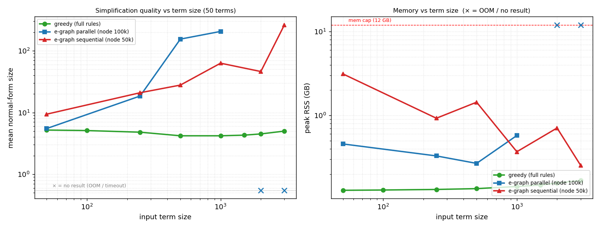

*Figure RQ4f. Mean normal-form size (left) and peak memory (right, log)
vs. input term size. × = no result (OOM / extraction timeout).*

| input size | greedy | parallel (100 k) | sequential (50 k) |
|-----------:|-------:|-----------------:|------------------:|
| 50   | 5 | 6   | 9   |
| 250  | 5 | 19  | 21  |
| 500  | 4 | 154 | 28  |
| 1000 | 4 | 206 | 63  |
| 2000 | 5 | ✗   | 46  |
| 3000 | 5 | ✗   | 262 |

*(mean normal-form size; greedy is flat ~4–5 at every size, both e-graph modes
degrade with size, parallel stops returning past ~1000.)*

**Greedy is also ~2 orders of magnitude faster:**

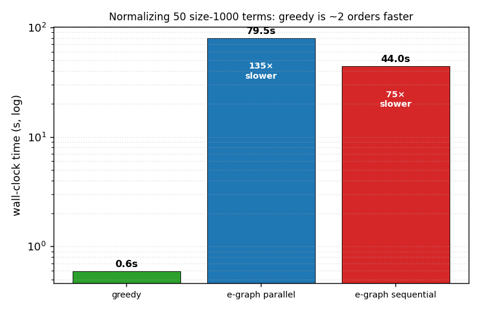

*Figure RQ4g. Wall-clock to normalize 50 size-1000 terms: greedy 0.6 s vs.
parallel 79 s (135×) and sequential 44 s (75×).*

- **Greedy**: flat quality (~4–5), **<1 s**, ~0.15 GB at every size — cost is
  independent of term count and iterations.
- **Parallel e-graph**: quality collapses past size ~500 (node cap bites earlier
  for bigger terms) and it **stops returning past ~1000** (global extraction from
  the ~1 M-node graph never finishes; a higher cap OOMs — space, never time).
- **Sequential e-graph**: per-term extraction is cheap so it is the *only* mode
  that still returns at size 3000, but quality is poor and variable and it is
  ~75× slower than greedy. Its memory *decreases* with term size (right panel,
  red): the node cap is checked between iterations, so peak memory is set by the
  iteration that overshoots it. A *small* term reaches the cap only after many
  iterations and crosses it with a large multiplicative jump (big overshoot — a
  single size-50 term peaks at 0.57 GB); a *large* term already starts near the
  cap and crosses it in 1–2 iterations with little overshoot (size-3000: 0.14 GB).

Net on large terms: **greedy ≫ sequential e-graph ≫ parallel e-graph**.
Full matrix and trajectories: `eval/terms/bench/FINDINGS.md`.

### Headline: our greedy vs. Ruler's e-graph

The fairest single picture pits each tool's *intended* normalizer against the
other's: Ruler's rules under **equality saturation** (its designed setting) vs.
our (variable) rules under **plain greedy** normalization (ours), at the matched
size 9 and with our full complete set.

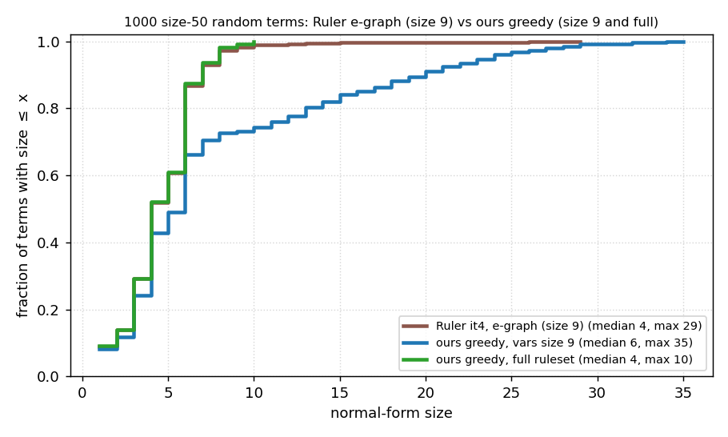

*Figure RQ4e. 1000 size-50 random terms. Ruler `it4` in a full e-graph reaches
median 4 (max 29); our variable `s9` rules under a single greedy /
discrimination-tree pass reach median 6 (max 35); our **full** rules under the
same greedy pass reach **median 4, max 10**.*

Two takeaways. **(1) Even our cheap, size-9 greedy pass is competitive with
Ruler's full equality-saturation machinery** — medians 6 vs. 4, within ~2 nodes,
without building an e-graph at all. **(2) Our *complete* set under plain greedy
*matches* Ruler's e-graph on the median (4 vs. 4) and is strictly better in the
worst case (max 10 vs. 29):** because every greedy normal form is an irreducible,
our complete set cannot leave anything above size 10 (the largest irreducible),
whereas the bounded e-graph still has a tail out to 29. (For reference, *holes-only*
greedy at size 9 reaches only median 23 — the variable rules are what make greedy
competitive at a size cap, cf. Fig. RQ4b.)

The same comparison on **size-1000** inputs sharpens the picture:

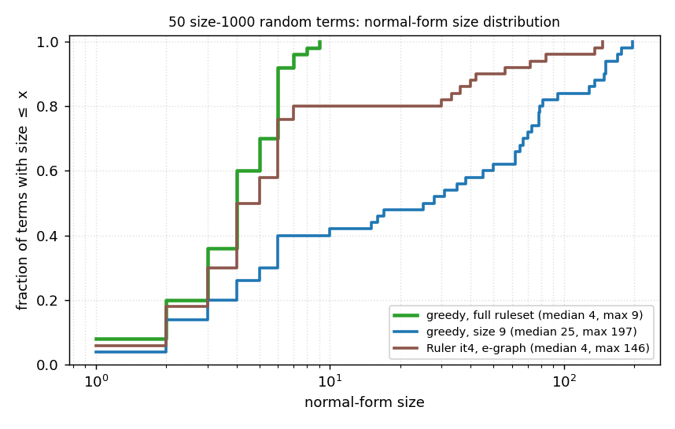

*Figure RQ4e(b). 50 size-1000 random terms. Greedy with the full set reduces
*every* term to ≤ 9 (median 4); Ruler `it4` in an e-graph has the same median but
a heavy tail (20 % of terms stay > 10, up to 146); greedy with the size-9 set is
weakest (median 25). On large terms greedy-full is both the most reliable and the
only one with a hard size bound.*

---

## Which results to present

1. **Fig. 1** — `eval/bool_vcs3.{png,tex}`: convergence (+KR/+IR → 0 at size 14).
2. **Fig. 2** — `eval/bool_v0c3.{png,tex}` beside Fig. 1: vars vs. holes (Sec. 2).
3. **Table 1** — per-domain final SR/KR/IR + reached size + time (Sec. 1).
4. **Table 2** — Ruler mutual derivability, the `it4 ↔ s9` row (Sec. 3).
5. **Fig. 3** — `eval/terms/fig_completeness.{png,tex}`: the completeness wall
   at size 10 (RQ4a) — the most compelling single simplification figure.
6. **Fig. 4** — `eval/terms/fig_completeness_vars.{png,tex}` beside Fig. 3: the
   same with variables (RQ4b) — incomplete variable sets already simplify well.
7. **Fig. 5** — `eval/terms/fig_ruler.{png,tex}` and
   `eval/terms/fig_eqsat.{png,tex}` side by side (RQ4c/d): Ruler vs. ours under
   greedy vs. e-graph — the method-vs-rule-style story.
8. **Fig. 6 (headline)** — `eval/terms/fig_final.{png,tex}` (RQ4e): our plain
   greedy (size 9 and full) vs. Ruler's e-graph — our complete set matches the
   e-graph median and beats its worst case, no e-graph needed.
9. **Table 3** — synthesis cost (§3): our size-5/9 holes/vars and full runs vs.
   Ruler `it2`/`it4` generation time.

---

# Appendix: files, naming, and reproduction

## Run modes (`bin/main.ml`)

- **Synthesis** (default): `--domain D --max-vcs/--max-vars/--max-holes --max-size N`,
  outputs `--stats CSV`, `--rule-output .rules`, `--irred-output .irs`,
  `--output .txt`. `--full` = exhaustive (bool); `--smt` = SMT refinement
  (int/bv); `RULE_ENUM_BV_WIDTH` sets the bitvector width.
- **Eval / normalize**: `--eval --rules-input R.rules --terms-input T.txt
  --output N.txt` greedily rewrites each term in `T` to normal form using `R`.

## Naming convention

A synthesis run has a stem like `bool_vcs3`. The stem encodes the setting:

- `bool` / `int` / `bv4` — the domain (`bv4` = bitvectors of width 4).
- `vcs3` — VARS + holes, bound `k = 3` (`--max-vcs 3`).
- `v0c3` — **v**ars **0**, holes (**c**onstants) 3 (holes-only).
- `_sN` suffix — same setting capped at `--max-size N` (used to match Ruler's
  rule sizes in RQ3 and to show the completeness sweep in RQ4a).

Per stem, the files are:

| extension | contents | produced by |
|-----------|----------|-------------|
| `.log` | per-size progress (header + one line/size) | synthesis stdout |
| `.csv` | same data, machine-readable | `--stats` or `scripts/log2csv.py` |
| `.rules` | rewrite rules, `lhs -> rhs` (UPPER = pattern var/hole, lower = object var) | `--rule-output` |
| `.irs` | irreducible representatives (the normal forms) | `--irred-output` |
| `.txt` | full textual report | `--output` |
| `.png` / `.tex` | convergence plot | `scripts/visualize.py` |

## Directory map

```
eval/
  bool_vcs3.*        bool, 3 vars + 3 holes        (RQ1, RQ2)
  bool_v0c3.*        bool, holes only              (RQ1, RQ2)
  int_vcs3.*         integers, SMT                 (RQ1)
  bv4_vcs3.*         bitvectors width 4, SMT       (RQ1)
  *_s{5,7,9}.*       size-capped variants          (RQ3, RQ4)
  v1/                older run, kept for reference — ignore
  ruler/             comparison with Ruler (RQ3)
    ruler_bool_3_{2,4}_0.json   Ruler's rulesets (it2 / it4)
    ruler_bool_3_{2,4}_0.txt    their rule terms (input to "ours normalize theirs")
    ruler_bool_3_{2,4}_0.rules  same, in our .rules format (scripts/ruler_to_rules.py)
    ruler_..._norm_{v0c3,vcs3}.txt   Ruler's terms after OUR normalization
    bool_v0c3*.json / bool_vcs3.json  OUR rules exported to Ruler JSON (scripts/rules_to_ruler.py)
  terms/             random-term simplification (RQ4)
    bool_{50,500}_3.txt         1000 random terms of size 50 / 500, prefix notation (scripts/termgen.py)
    bool_{50,500}_3_sexpr.txt   same, s-expression notation (for egglog)
    norm_term_{N}_{stem}.txt    OUR greedy normal forms (.count + .png histograms)
    ruler_term_50__3_{2,4}_0.txt   greedy normal forms using RULER's rules
    eqsat_{ruler_itN,v0c3_sN}_bool_50_3__it2_{parallel,sequential}.txt
                                e-graph normal forms (scripts/egglog/simplify.py)
    fig_completeness.{png,tex}       RQ4a figure (holes-only greedy)   (scripts/plot_eval.py)
    fig_completeness_vars.{png,tex}  RQ4b figure (variables greedy)
    fig_ruler.{png,tex}              RQ4c figure (Ruler vs ours, greedy)
    fig_eqsat.{png,tex}              RQ4d figure (Ruler vs ours, e-graph)
    fig_final.{png,tex}              RQ4e headline (ours greedy vs Ruler e-graph, size 9)
scripts/ruler/       OOPSLA'21 Ruler artifact (cargo); derive_*.json are the RQ3 results
```

`scripts/ruler/derive_*.json` hold the RQ3 mutual-derivability counts
(`forward` / `reverse`), produced by Ruler's `bool derive A.json B.json`.

## Helper scripts

| script | purpose |
|--------|---------|
| `scripts/log2csv.py` | `.log` → `.csv` |
| `scripts/visualize.py` | stats `.csv` → convergence `.png` + `.tex` |
| `scripts/termgen.py` | generate random terms (size, #vars, seed, notation) |
| `scripts/term_size_counter.py` | term file → size histogram `.count` + `.png` |
| `scripts/plot_eval.py` | RQ4 comparison figures (completeness holes/vars, Ruler greedy/e-graph) |
| `scripts/ruler_to_rules.py` | Ruler JSON → our `.rules` |
| `scripts/rules_to_ruler.py` | our `.rules` → Ruler JSON (for `derive`) |
| `scripts/ruler_rules_to_term.py` | Ruler JSON → term list (for "ours normalize theirs") |
| `scripts/egglog/simplify.py` | e-graph (equality-saturation) normalization |

## Reproduction

`reproduce_eval.sh` regenerates everything, part by part. Each subcommand maps
to a section above:

```
./reproduce_eval.sh synth [bool|v0c3|int|bv4|all]   # RQ1, RQ2
./reproduce_eval.sh sizecap <v0c3|vcs3> <N>         # RQ3/RQ4 size caps
./reproduce_eval.sh viz                             # convergence plots
./reproduce_eval.sh ruler-prep | ruler-norm | ruler-derive [s5|s7|s9]   # RQ3
./reproduce_eval.sh termgen | terms-greedy | terms-eqsat | counts        # RQ4
python scripts/plot_eval.py                         # RQ4 figures
./reproduce_eval.sh all                             # everything (hours)
```

Tunables via env vars: `EVAL`, `JOBS`, `MAXSIZE`, `RANDOM_INPUTS`, `BV_WIDTH`,
and `DRY=1` to print commands instead of running them. See
`./reproduce_eval.sh help`.
